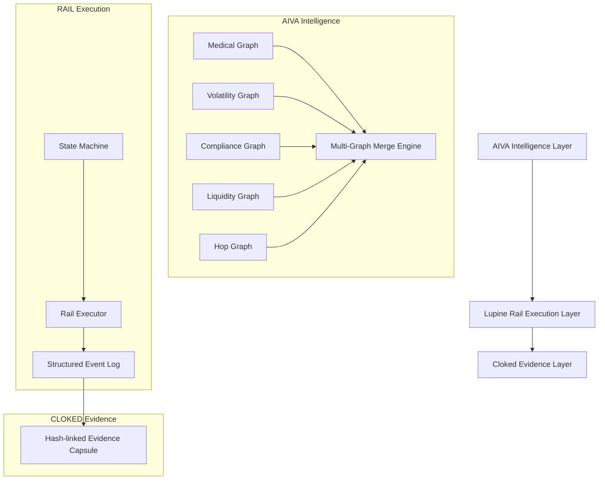
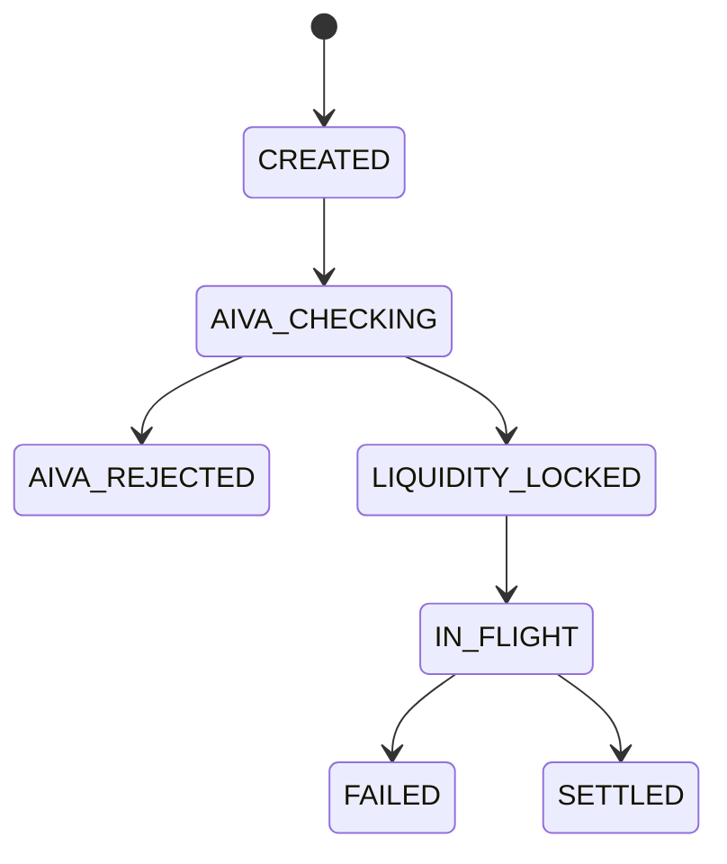

# LUPINE SYSTEMS — README

## Overview
Lupine Systems is a multi-layer value‑movement architecture composed of three coordinated subsystems:

- **AIVA** — Intelligent multi‑graph routing & risk evaluation  
- **LUPINE RAIL** — Resilient settlement & movement pipeline  
- **CLOKED** — Evidence, audit & verifiable truth layer  

This README summarises Phase 1 development progress, includes architecture diagrams, and documents the implemented components.

---

## 🌐 High‑Level Architecture



---

## 🚀 AIVA: Intelligence Layer

AIVA decides whether a route is safe, viable, liquid, and compliant using five graph engines:

### 🫀 MedicalGraph (Thermal Viability)
- Determines biological viability based on:
  - payload type  
  - transit duration  
  - container temperature  
- Implements deterministic spoilage thresholds.

### 📉 VolatilityGraph (FX Market Conditions)
- Normalises FX volatility into a safety score.  
- Rejects if above configured threshold.

### 🛂 ComplianceGraph (Sanctions Risk)
- Rejects blacklisted countries.  
- Flags high-risk corridors.

### 💧 LiquidityGraph (Funding Capacity)
- Simulates available balances per node.  
- Rejects insufficient liquidity.

### 🔗 HopGraph & Merge Engine
- Builds settlement corridors.  
- Merges risk + liquidity + volatility + compliance into a unified score.

---

## 🚂 LUPINE RAIL: Execution Layer

### 🔧 Transaction State Machine



### 🛠 Rail Executor
- Performs settlement hops.  
- Includes **Chaos Monkey (25% chance of network failure)**.  
- Implements **Retry Logic (max 3 attempts per hop)**.

### 🧾 Structured Event Logging (Story 4.4)
Every hop, attempt, retry, success, and final settlement is captured as a structured event:

- UUID  
- Timestamp  
- Event Type  
- Details (node, attempt, status, etc.)

---

## 🔐 CLOKED: Evidence Layer

Hash‑linked audit log ensuring immutability and forensic replayability:

- Every event hashed  
- Linked to previous event  
- Replayable chain (like a mini blockchain)

---

## 🧪 Test Suite (tests/test_risk_scenarios.py)

The system includes six scenarios:

1. **Scenario A** — Medical Fast Route  
2. **Scenario B** — Medical Slow Route  
3. **Scenario C** — FX Market Crash  
4. **Scenario D** — Sanctions Compliance Failure  
5. **Scenario E** — Liquidity Crunch  
6. **Scenario F** — Rail Resilience (Retries & Failover)

---

## 📦 Project Structure

```
lupine-systems-core/
├── src/
│   ├── aiva/
│   │   ├── medical_graph.py
│   │   ├── volatility_graph.py
│   │   ├── compliance_graph.py
│   │   ├── liquidity_graph.py
│   │   ├── hop_graph.py
│   │   └── merge_engine.py
│   ├── rail/
│   │   ├── state_machine.py
│   │   ├── executor.py
│   │   └── events.py
│   └── cloked/
│       └── auditor.py
├── tests/
│   └── test_risk_scenarios.py
└── main_skeleton.py
```

---

## 📈 Phase 1 Progress

| Component | Status | Details |
|----------|--------|---------|
| Medical Risk Engine | ✅ Done | Deterministic thermal decay |
| Volatility Engine | ✅ Done | FX-safe scoring & rejection |
| Compliance Engine | ✅ Done | Sanctions + high-risk handling |
| Liquidity Engine | ✅ Done | Node balance + stress logic |
| AIVA Merge Engine | 🟩 In Progress | Multi‑graph score fusion |
| Rail Executor | ✅ Done | Hops, retries, resilience |
| Structured Events | ✅ Done | JSON logs for each hop |
| Test Suite | ✅ Done | Full risk‑scenario coverage |

---

## 🎯 Next Steps (Phase 2)

- AIVA: Weighted composite scoring  
- Rail: Multi-hop settlement chains  
- Cloked: Evidence capsule encryption  
- API Layer: Public routing endpoint  
- CLI Tool: lupctl for running transactions  

---

## 📜 License
Internal experimental research prototype.

