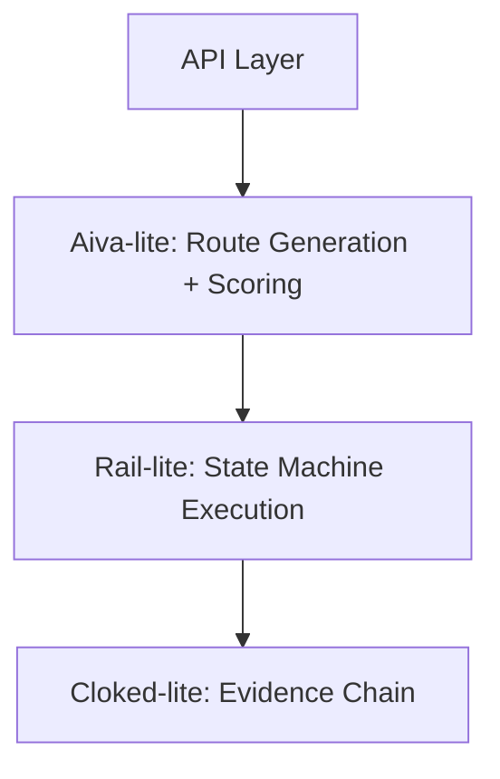

# Lupine Systems V0

> Lupine decides how value moves when the cost of getting it wrong is high.

## What V0 is

A movement decision engine for high-stakes transfers. Not a full payment network. Not medical logistics yet. Just the first working loop:

1. Take a movement request
2. Compare route options
3. Choose the best route
4. Simulate execution
5. Produce a decision and evidence log

## Architecture

V0 preserves the book's three-layer spine:

- **Aiva-lite** — Intelligence: scores routes, selects optimal path
- **Rail-lite** — Execution: state machine that simulates movement
- **Cloked-lite** — Trust: evidence log proving what happened and why


```mermaid
flowchart TD
    API[API Layer] --> AIVA[Aiva-lite: Route Generation + Scoring]
    AIVA --> RAIL[Rail-lite: State Machine Execution]
    RAIL --> CLOKED[Cloked-lite: Evidence Chain]
```

## V0 Demo Scenario

- Amount: 500,000
- From: AUD
- To: SGD
- Urgency: high

Three routes evaluated (Fast, Cheap, Balanced), scored on speed/cost/reliability, best selected with full explanation and evidence trail.

## API Endpoints

| Endpoint                      | Method | Description                              |
|-------------------------------|--------|------------------------------------------|
| `/create-movement`            | POST   | Submit a movement request                |
| `/get-routes/{request_id}`    | GET    | Generate route options for a request     |
| `/score-routes/{request_id}`  | POST   | Score all routes, select optimal         |
| `/execute/{request_id}`       | POST   | Simulate execution through state machine |
| `/log/{request_id}`           | GET    | Retrieve full evidence log               |

## Tech Stack

- Python 3.11+
- FastAPI
- Pydantic v2 (data models)
- UUID for request/evidence tracking
- SHA-256 for evidence hashing

## Quick Start

```bash
pip install -r requirements.txt
uvicorn src.api.main:app --reload
```

## Run Tests

```bash
pytest tests/ -v
```

## Project Structure

```
lupine-systems-core/
├── src/
│   ├── aiva_lite/        # Route generation, scoring, selection
│   │   ├── router.py     # Route option generation
│   │   ├── scorer.py     # Multi-dimension scoring engine
│   │   └── selector.py   # Pareto frontier / route selection
│   ├── rail_lite/        # Execution state machine
│   │   └── executor.py   # State transitions, simulation
│   ├── cloked_lite/      # Evidence logging
│   │   └── logger.py     # Hash chain, evidence capsules
│   ├── models/           # Pydantic data models
│   │   └── schemas.py    # All V0 data objects
│   └── api/              # FastAPI endpoints
│       └── main.py       # All 5 endpoints
├── tests/
│   ├── test_aiva.py
│   ├── test_rail.py
│   └── test_cloked.py
├── docs/
│   └── v0_spec.md
├── requirements.txt
└── README.md
```

## License

Internal experimental research prototype.  
Trademark Chris Gogoi
