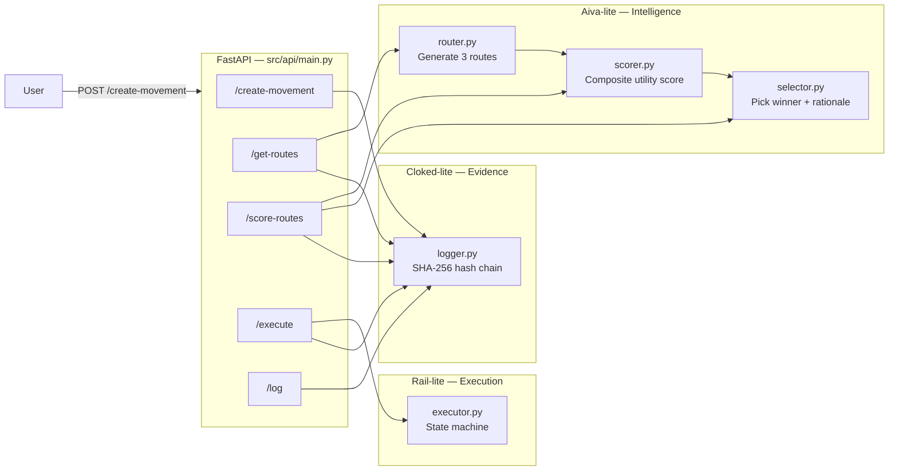
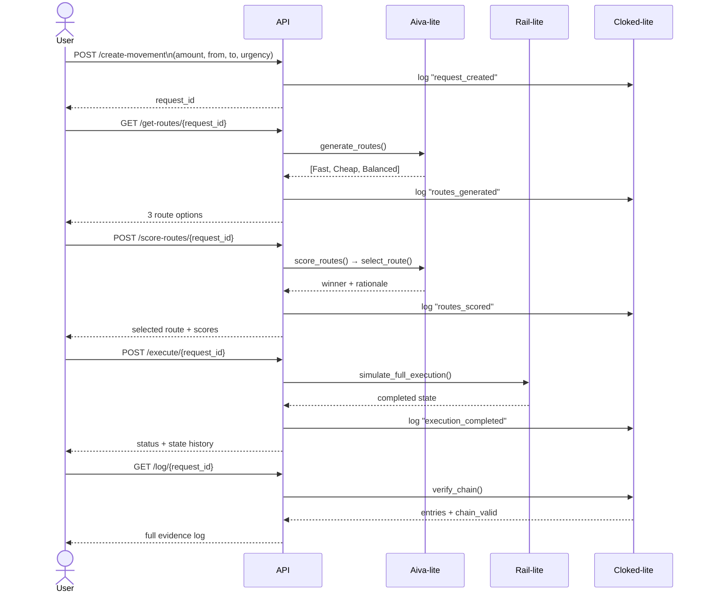
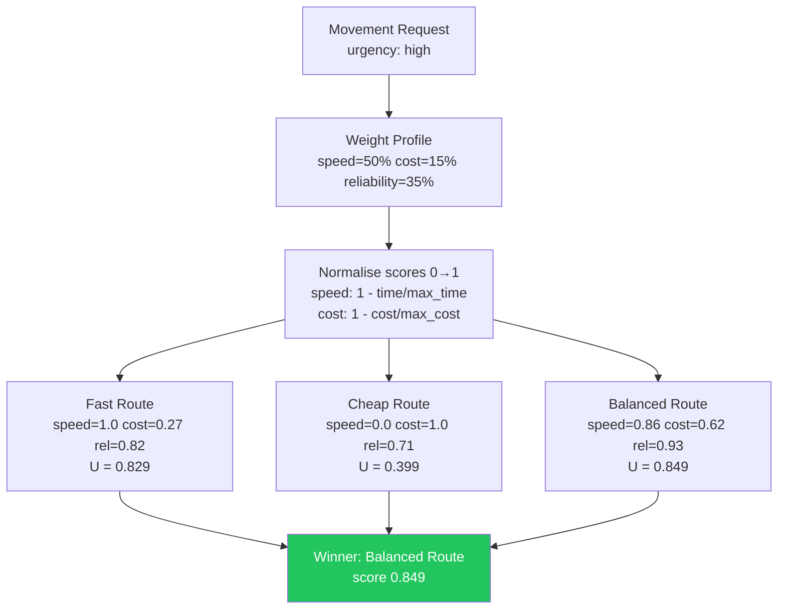
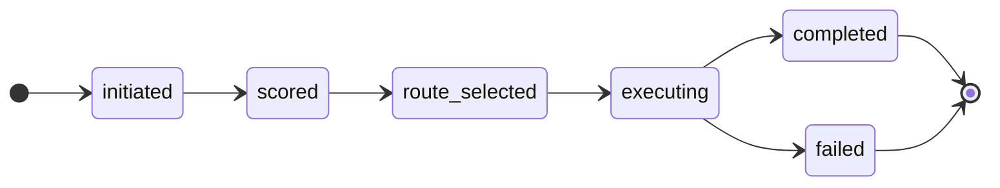
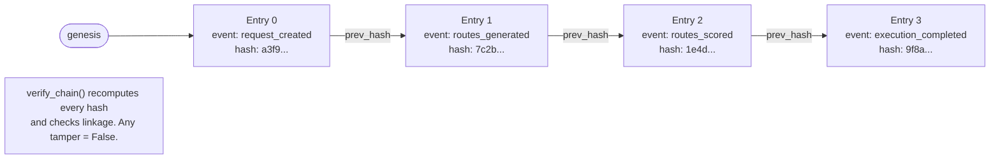

# Lupine Systems — V0

> Lupine decides how value moves when the cost of getting it wrong is high.

V0 is the first working loop: take a movement request, score route options, pick the best one, simulate execution, and produce a cryptographic evidence log.

**New to Lupine? Start here → [Plain English Guide](./docs/guide.md)**

---

## V0 System Overview


```mermaid
flowchart LR
    User -->|POST /create-movement| API

    subgraph API["FastAPI — src/api/main.py"]
        EP1["/create-movement"]
        EP2["/get-routes"]
        EP3["/score-routes"]
        EP4["/execute"]
        EP5["/log"]
    end

    subgraph AIVA_LITE["Aiva-lite — Intelligence"]
        R["router.py\nGenerate 3 routes"]
        S["scorer.py\nComposite utility score"]
        SEL["selector.py\nPick winner + rationale"]
        R --> S --> SEL
    end

    subgraph RAIL_LITE["Rail-lite — Execution"]
        SM["executor.py\nState machine"]
    end

    subgraph CLOKED_LITE["Cloked-lite — Evidence"]
        L["logger.py\nSHA-256 hash chain"]
    end

    EP2 --> R
    EP3 --> S
    EP3 --> SEL
    EP4 --> SM
    EP1 & EP2 & EP3 & EP4 --> L
    EP5 --> L
```

---

## API — 5-Step Flow


```mermaid
sequenceDiagram
    actor User
    participant API
    participant Aiva-lite
    participant Rail-lite
    participant Cloked-lite

    User->>API: POST /create-movement\n(amount, from, to, urgency)
    API->>Cloked-lite: log "request_created"
    API-->>User: request_id

    User->>API: GET /get-routes/{request_id}
    API->>Aiva-lite: generate_routes()
    Aiva-lite-->>API: [Fast, Cheap, Balanced]
    API->>Cloked-lite: log "routes_generated"
    API-->>User: 3 route options

    User->>API: POST /score-routes/{request_id}
    API->>Aiva-lite: score_routes() → select_route()
    Aiva-lite-->>API: winner + rationale
    API->>Cloked-lite: log "routes_scored"
    API-->>User: selected route + scores

    User->>API: POST /execute/{request_id}
    API->>Rail-lite: simulate_full_execution()
    Rail-lite-->>API: completed state
    API->>Cloked-lite: log "execution_completed"
    API-->>User: status + state history

    User->>API: GET /log/{request_id}
    API->>Cloked-lite: verify_chain()
    Cloked-lite-->>API: entries + chain_valid
    API-->>User: full evidence log
```

---

## Aiva-lite — Route Scoring

Composite utility: **U = w₁·Speed + w₂·Cost + w₃·Reliability**

Weights shift automatically based on urgency:

| Urgency  | Speed | Cost | Reliability |
|----------|------:|-----:|------------:|
| low      |  15%  |  55% |         30% |
| normal   |  25%  |  35% |         40% |
| high     |  50%  |  15% |         35% |
| critical |  60%  |   5% |         35% |


```mermaid
flowchart TD
    REQ["Movement Request\nurgency: high"] --> WP["Weight Profile\nspeed=50% cost=15% reliability=35%"]
    WP --> NORM["Normalise scores 0→1\nspeed: 1 - time/max_time\ncost:  1 - cost/max_cost"]

    NORM --> R1["Fast Route\nspeed=1.0 cost=0.27 rel=0.82\nU = 0.829"]
    NORM --> R2["Cheap Route\nspeed=0.0 cost=1.0 rel=0.71\nU = 0.399"]
    NORM --> R3["Balanced Route\nspeed=0.86 cost=0.62 rel=0.93\nU = 0.849"]

    R1 & R2 & R3 --> WIN["Winner: Balanced Route\nscore 0.849"]

    style WIN fill:#22c55e,color:#fff
```

---

## Rail-lite — Execution State Machine


```mermaid
stateDiagram-v2
    direction LR
    [*] --> initiated
    initiated --> scored
    scored --> route_selected
    route_selected --> executing
    executing --> completed
    executing --> failed
    completed --> [*]
    failed --> [*]
```

Invalid transitions raise `ValueError` — the state machine enforces every step.

---

## Cloked-lite — SHA-256 Evidence Chain


```mermaid
flowchart LR
    G([genesis]) --> E0

    E0["Entry 0\nevent: request_created\nhash: a3f9..."]
    E1["Entry 1\nevent: routes_generated\nhash: 7c2b..."]
    E2["Entry 2\nevent: routes_scored\nhash: 1e4d..."]
    E3["Entry 3\nevent: execution_completed\nhash: 9f8a..."]

    E0 -->|prev_hash| E1
    E1 -->|prev_hash| E2
    E2 -->|prev_hash| E3

    NOTE["verify_chain() recomputes every hash\nand checks linkage. Any tamper = False."]
```

---

## Quick Start

```bash
pip install -r requirements.txt
uvicorn src.api.main:app --reload
```

Then call the endpoints in order:

```bash
# 1. Create a movement request
curl -X POST "http://localhost:8000/create-movement?amount=500000&from_currency=AUD&to_currency=SGD&urgency=high"

# 2. Get routes (use request_id from step 1)
curl "http://localhost:8000/get-routes/{request_id}"

# 3. Score and select
curl -X POST "http://localhost:8000/score-routes/{request_id}"

# 4. Execute
curl -X POST "http://localhost:8000/execute/{request_id}"

# 5. View evidence log
curl "http://localhost:8000/log/{request_id}"
```

---

## Project Structure

```
lupine-systems-core/
├── src/
│   ├── models/           # Pydantic data models
│   │   └── schemas.py
│   ├── aiva_lite/        # Intelligence layer
│   │   ├── router.py     #   route generation
│   │   ├── scorer.py     #   composite utility scoring
│   │   └── selector.py   #   winner selection + rationale
│   ├── rail_lite/        # Execution layer
│   │   └── executor.py   #   state machine
│   ├── cloked_lite/      # Evidence layer
│   │   └── logger.py     #   SHA-256 hash chain
│   └── api/              # FastAPI app (5 endpoints)
│       └── main.py
├── tests/
│   ├── test_aiva.py      # routing + scoring
│   ├── test_rail.py      # state machine transitions
│   └── test_cloked.py    # evidence chain integrity
├── docs/
│   └── v0_spec.md
└── requirements.txt
```

---

## V0 Status

| Component | Status | Details |
|-----------|--------|---------|
| Data Models | ✅ Done | Pydantic schemas for all V0 primitives |
| Aiva-lite Router | ✅ Done | 3 simulated route candidates |
| Aiva-lite Scorer | ✅ Done | Composite utility, urgency-weighted |
| Aiva-lite Selector | ✅ Done | Winner selection + human rationale |
| Rail-lite Executor | ✅ Done | 5-state machine, validated transitions |
| Cloked-lite Logger | ✅ Done | SHA-256 hash chain, tamper detection |
| FastAPI (5 endpoints) | ✅ Done | Full V0 request loop |
| Test Suite (10 tests) | ✅ Done | Routing, scoring, states, chain integrity |
| CI (GitHub Actions) | ✅ Done | Runs on every push |

---

## License
Internal experimental research prototype. Copyright Chirantan Gogoi.
