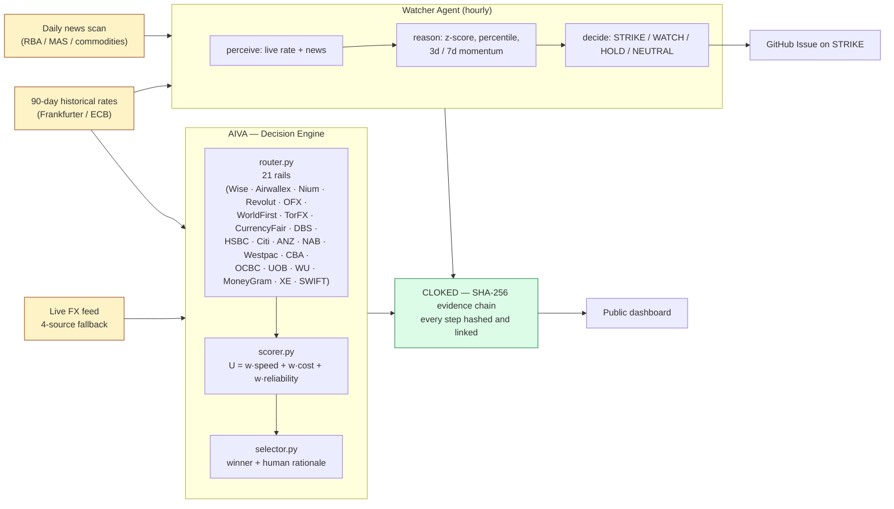
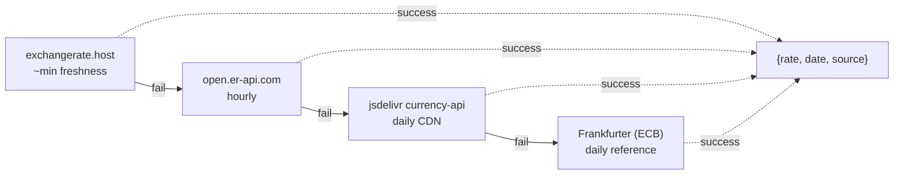
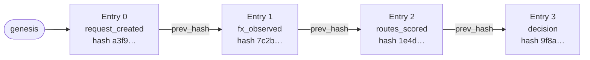
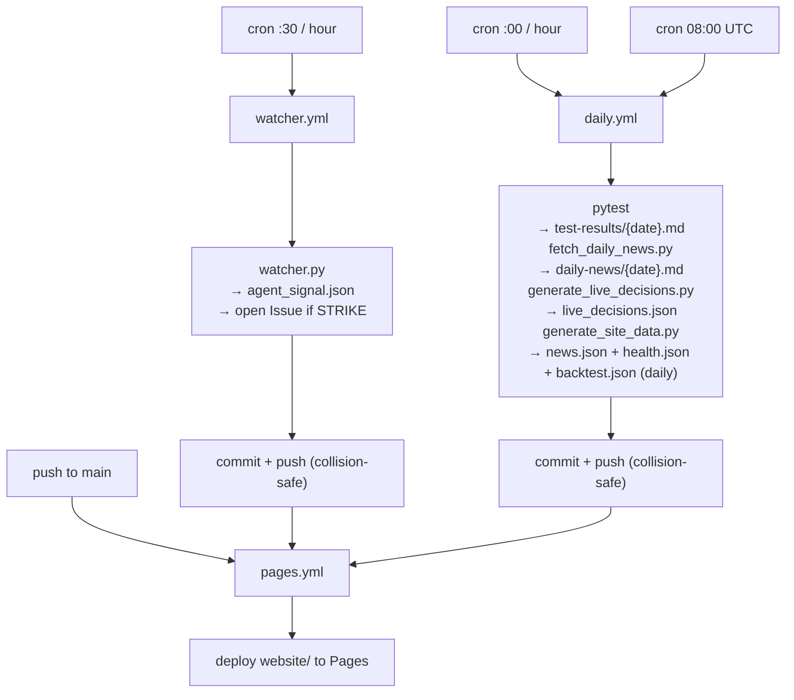

# Lupine Systems — V0

> **Mission.** Lupine decides how value moves when the cost of getting it wrong
> is high. Every decision is reasoned in public, scored against live market
> data, and sealed in a tamper-evident audit chain — so the *why* behind every
> recommendation is as durable as the recommendation itself.

V0 is the working loop: take a movement request, score 21 real-world rails
against the live AUD/SGD rate, pick the best one for the urgency profile,
and produce a SHA-256 evidence chain proving what was decided and why.
A second autonomous agent watches the market hourly and surfaces favourable
transfer windows on its own.

**Live system:** <https://cheeroo2020.github.io/lupine-systems-core>
**Quick read:** [Plain English Guide](./docs/guide.md)

---

## What's running today

| Surface | Status | Refresh cadence | Source |
|---|---|---|---|
| 21-rail decision engine | ✅ live | per request | `src/aiva_lite/router.py` |
| Multi-source FX feed | ✅ live | on demand (4-source fallback chain) | `src/data/fx_feed.py` |
| 90-day backtest | ✅ live | daily | `scripts/backtest.py` |
| Watcher agent (STRIKE / WATCH / HOLD) | ✅ live | hourly | `scripts/watcher.py` |
| CLOKED audit chain | ✅ live | every decision | `src/cloked_lite/logger.py` |
| Daily news + health snapshot | ✅ live | hourly catch-up, fires once/day | `daily.yml` |
| Public website (GitHub Pages) | ✅ live | on every push to `main` | `pages.yml` |

---

## Mission, in one diagram


```mermaid
flowchart LR
    LIVE["Live FX feed<br/>4-source fallback"]:::data
    HIST["90-day historical rates<br/>(Frankfurter / ECB)"]:::data
    NEWS["Daily news scan<br/>(RBA / MAS / commodities)"]:::data

    LIVE --> ENGINE
    HIST --> ENGINE
    HIST --> WATCHER
    NEWS --> WATCHER

    subgraph ENGINE["AIVA — Decision Engine"]
        R["router.py<br/>21 rails<br/>(Wise · Airwallex · Nium · Revolut · OFX ·<br/>WorldFirst · TorFX · CurrencyFair · DBS ·<br/>HSBC · Citi · ANZ · NAB · Westpac · CBA ·<br/>OCBC · UOB · WU · MoneyGram · XE · SWIFT)"]
        S["scorer.py<br/>U = w·speed + w·cost + w·reliability"]
        SEL["selector.py<br/>winner + human rationale"]
        R --> S --> SEL
    end

    subgraph WATCHER["Watcher Agent (hourly)"]
        P["perceive: live rate + news"]
        RZ["reason: z-score, percentile,<br/>3d / 7d momentum"]
        D["decide: STRIKE / WATCH / HOLD / NEUTRAL"]
        P --> RZ --> D
    end

    ENGINE --> CLOKED
    WATCHER --> CLOKED

    CLOKED["CLOKED — SHA-256 evidence chain<br/>every step hashed and linked"]:::seal

    CLOKED --> SITE["Public dashboard"]
    D --> ISSUE["GitHub Issue on STRIKE"]

    classDef data fill:#fef3c7,stroke:#92400e
    classDef seal fill:#dcfce7,stroke:#15803d
```

---

## Why 21 rails

The original V0 had 3 simulated routes. The current system models real
provider economics for every rail a A$500K AUD→SGD payer can practically use:

| Tier | Rails | Typical fee (bps) | Settlement |
|---|---|---|---|
| Digital-first | Nium, Airwallex, WorldFirst, Revolut, Wise, TorFX, OFX, CurrencyFair | 25 – 55 | 1 – 48 h |
| Bank digital / regional | DBS Remit, XE | 80 – 90 | 18 – 48 h |
| Legacy retail | Western Union, MoneyGram | 120 – 160 | 1 – 2 days |
| Major banks (AU side) | HSBC, Citi, ANZ, NAB, Westpac, CBA | 150 – 225 | 1 – 1.5 days |
| Major banks (SG side) | OCBC, UOB | 200 – 205 | 1 day |
| Generic SWIFT | Bank SWIFT (worst-case baseline) | 250+ | 1.5 days |

At normal urgency on A$500K, Wise (45 bps) saves ~A$10,270 vs a generic
bank SWIFT transfer — every single trading day.

---

## Decision engine — urgency-weighted scoring

Composite utility: **U = w·speed + w·cost + w·reliability**

| Urgency | Speed | Cost | Reliability |
|---|--:|--:|--:|
| low | 15% | 55% | 30% |
| normal | 25% | 35% | 40% |
| high | 50% | 15% | 35% |
| critical | 60% | 5% | 35% |

Speed and cost are min-max normalised across the candidate set so the
weights have a comparable dynamic range.

---

## Multi-source FX feed (`src/data/fx_feed.py`)

Designed so a single source outage never breaks the system:


```mermaid
flowchart LR
    A["exchangerate.host<br/>~min freshness"] -->|fail| B["open.er-api.com<br/>hourly"]
    B -->|fail| C["jsdelivr currency-api<br/>daily CDN"]
    C -->|fail| D["Frankfurter (ECB)<br/>daily reference"]
    A -.success.-> OUT["{rate, date, source}"]
    B -.success.-> OUT
    C -.success.-> OUT
    D -.success.-> OUT
```

Each source is tried in priority order. The selected source is recorded
on every signal, so the dashboard can show provenance.

---

## CLOKED evidence chain


```mermaid
flowchart LR
    G([genesis]) --> E0
    E0["Entry 0<br/>request_created<br/>hash a3f9…"]
    E1["Entry 1<br/>fx_observed<br/>hash 7c2b…"]
    E2["Entry 2<br/>routes_scored<br/>hash 1e4d…"]
    E3["Entry 3<br/>decision<br/>hash 9f8a…"]
    E0 -->|prev_hash| E1 -->|prev_hash| E2 -->|prev_hash| E3
```

`verify_chain()` recomputes every hash and checks linkage. Any tamper → False.
The watcher and the daily decision generator both use this chain — every
recommendation on the live site has a verifiable evidence trail.

---

## Watcher agent (`scripts/watcher.py`)

Runs every hour at `:30` via `.github/workflows/watcher.yml`. Perceives,
reasons, decides, acts:

1. **Perceive** — fetches live AUD/SGD via the multi-source feed; scans the
   most recent daily-news files for RBA / MAS / commodity keywords.
2. **Reason** — computes z-score, 60-day percentile, 3-day and 7-day momentum.
3. **Decide** — applies a rule set: top decile → `STRIKE`; above-mean +
   confirming news → `STRIKE`; bottom decile → `HOLD`; etc.
4. **Act** — writes `website/data/agent_signal.json` and opens a GitHub
   Issue on a STRIKE day (with duplicate-suppression for the same date).

Every step is appended to a CLOKED chain and the final hash is published
in the signal file for independent verification.

---

## Automation map


```mermaid
flowchart TD
    CRON1["cron :30 / hour"] --> WF1["watcher.yml"]
    CRON2["cron :00 / hour"] --> WF2["daily.yml"]
    CRON3["cron 08:00 UTC"] --> WF2
    PUSH["push to main"] --> WF3["pages.yml"]

    WF1 --> WS["watcher.py<br/>→ agent_signal.json<br/>→ open Issue if STRIKE"]
    WF2 --> WD["pytest<br/>→ test-results/{date}.md<br/>fetch_daily_news.py<br/>→ daily-news/{date}.md<br/>generate_live_decisions.py<br/>→ live_decisions.json<br/>generate_site_data.py<br/>→ news.json + health.json + backtest.json (daily)"]
    WF3 --> DEPLOY["deploy website/ to Pages"]

    WS --> COMMIT1["commit + push (collision-safe)"]
    WD --> COMMIT2["commit + push (collision-safe)"]
    COMMIT1 --> WF3
    COMMIT2 --> WF3
```

Every cron step has `continue-on-error: true` and every commit step does
`git pull --rebase` before pushing, so simultaneous workflow runs never
brick the pipeline.

---

## Recent fixes (May 2026)

- **Backtest daily refresh** — `_backtest_is_stale()` threshold lowered from
  7 days to 1, so the "Last 14 trading days" table moves with the calendar.
- **Date parsing** — `open.er-api.com` returns RFC-2822
  (`"Sat, 02 May 2026…"`), not ISO. Switched to `time_last_update_unix`
  so `rate_date` is always `YYYY-MM-DD`.
- **Brand logos** — Clearbit's free Logo API was deprecated post-acquisition.
  Swapped to Google's S2 favicon API with a coloured-initial fallback so
  every provider card has a visible identity even if the favicon fails.
- **21 rails** — expanded from 3 simulated routes to 21 real provider models
  covering fintechs, regional banks, and the AU/SG big-bank set.
- **Multi-source FX** — single Frankfurter dependency replaced with a
  4-source fallback chain.
- **Workflow hardening** — added `git pull --rebase` and
  `continue-on-error` to both `daily.yml` and `watcher.yml` commit steps,
  eliminating the "two crons pushed at the same time" failure mode.

---

## Quick start

```bash
pip install -r requirements.txt

# run the FastAPI loop locally
uvicorn src.api.main:app --reload

# refresh the live decisions JSON manually
PYTHONPATH=. python scripts/generate_live_decisions.py

# run the watcher manually
PYTHONPATH=. python scripts/watcher.py

# regenerate the 90-day backtest
PYTHONPATH=. python scripts/backtest.py
```

---

## Project structure

```
lupine-systems-core/
├── src/
│   ├── data/             # multi-source FX feed
│   ├── models/           # Pydantic schemas
│   ├── aiva_lite/        # router · scorer · selector
│   ├── rail_lite/        # 5-state execution machine
│   ├── cloked_lite/      # SHA-256 evidence chain
│   └── api/              # FastAPI (5 endpoints)
├── scripts/
│   ├── watcher.py                 # hourly market agent
│   ├── backtest.py                # 90-day decision replay
│   ├── generate_live_decisions.py # daily JSON for site
│   ├── generate_site_data.py      # news + health + backtest dispatch
│   └── fetch_daily_news.py        # daily RBA / MAS / FX scan
├── tests/                # 10 deterministic + live FX tests
├── website/              # static site deployed to Pages
│   └── data/             # generated JSON consumed by the dashboard
├── .github/workflows/
│   ├── ci.yml            # tests on every push
│   ├── daily.yml         # 24-slot self-healing daily pipeline
│   ├── watcher.yml       # hourly market watcher
│   └── pages.yml         # deploy site to GitHub Pages
├── daily-news/           # one markdown file per trading day
├── test-results/         # one markdown file per CI run
└── docs/
```

---

## Status

| Component | State |
|---|---|
| 21-rail decision engine | ✅ |
| Multi-source FX feed | ✅ |
| Watcher agent (hourly) | ✅ |
| Daily news + health pipeline | ✅ |
| 90-day backtest (daily refresh) | ✅ |
| CLOKED evidence chain | ✅ |
| Public dashboard (Pages) | ✅ |
| FastAPI (5 endpoints) | ✅ |
| Deterministic test suite (10 tests) | ✅ |
| CI (every push) | ✅ |

---

## License
Internal experimental research prototype. © Chirantan Gogoi.
