````markdown
# Lupine Systems — Core Infrastructure (Phase 1)

**"When the stakes are human, failure cannot be probabilistic."**

This repository holds the **Phase 1 technical foundation** of Lupine Systems:
- **Aiva**: Deterministic multi-graph intelligence engine (The Brain).
- **Lupine Rail**: Event-driven execution state machine (The Muscle).
- **Cloked**: Hash-linked evidence and audit capsule layer (The Truth).

The objective of Phase 1 is to build a **walking skeleton simulation**:
1. Aiva selects a route based on logic.
2. Rail executes the route hop-by-hop.
3. Cloked cryptographically logs the events.

---

## 📁 Project Structure

```text
lupine-systems-core/
├── docs/              # Architecture diagrams, Jira mappings
├── src/
│   ├── aiva/          # Intelligence Layer (Graphs & Routing)
│   │   ├── hop_graph.py      # Network topology
│   │   ├── mock_graphs.py    # Placeholder logic (Volatility/Medical)
│   │   └── merge_engine.py   # Routing logic
│   ├── rail/          # Execution Layer
│   │   ├── executor.py       # Hop simulator
│   │   └── state_machine.py  # Transaction states
│   └── cloked/        # Evidence Layer
│       └── auditor.py        # SHA-256 Hashing logger
├── main_skeleton.py   # The Steel Thread (Entry Point)
├── requirements.txt   # Dependencies
└── README.md          # This file
````

-----

## 🧬 System Architecture (The Steel Thread)

This diagram represents the flow of data in the current Skeleton build (`main_skeleton.py`).

```mermaid
graph TD
    %% Nodes
    Orchestrator(main_skeleton.py)
    
    subgraph AIVA [🟣 AIVA Intelligence]
        MergeEngine[merge_engine.py]
        HopGraph[hop_graph.py]
        MockGraphs[mock_graphs.py]
        
        MockGraphs -->|Scores| MergeEngine
        HopGraph -->|Topology| MergeEngine
    end

    subgraph RAIL [🔴 RAIL Execution]
        Executor[executor.py]
        StateMachine[state_machine.py]
        
        Executor -->|Update State| StateMachine
    end

    subgraph CLOKED [🟢 CLOKED Truth]
        Auditor[auditor.py]
        EvidenceLog[(Evidence Log)]
    end

    %% Flow
    Orchestrator -->|1. Request Route| MergeEngine
    MergeEngine -->|2. Return Route| Orchestrator
    
    Orchestrator -->|3. Execute Hop| Executor
    Executor -->|4. Status: COMPLETED| Orchestrator
    
    Orchestrator -->|5. Log Evidence| Auditor
    Auditor -->|6. SHA-256 Hash| EvidenceLog
```



*(Note: If the diagram above does not render, view this file on GitHub.com or use a Markdown viewer with Mermaid support.)*

-----

## 🚀 Phase 1 Progress

### 🟣 Aiva v0.1 (Routing)

  - [x] **Hop Graph** (Basic Topology)
  - [x] **Merge Engine** (Skeleton Logic)
  - [x] **Mock Graphs** (Placeholders for Volatility/Medical)
  - [ ] **Real Thermal Decay Logic** (Next Step)
  - [ ] **Corridor FX Logic**

### 🔴 Lupine Rail v0.1 (Execution)

  - [x] **State Machine** (INIT → MOVING → COMPLETED)
  - [x] **Hop Executor** (Simulation)
  - [ ] **Failover/Retry Logic**

### 🟢 Cloked v0.1 (Evidence)

  - [x] **Auditor** (Basic Logging)
  - [x] **Hashing** (SHA-256)
  - [ ] **Merkle Tree Implementation**
  - [ ] **JSON Capsule Schema**

-----

## 📦 Getting Started

### 1\. Install Dependencies

```bash
pip install -r requirements.txt
```

### 2\. Run the Skeleton Simulation

This runs the "Steel Thread"—proving that all three layers can talk to each other.

```bash
python main_skeleton.py
```

**Expected Output:**

```text
>>> RAIL: Executing hop to NodeA...
🔒 CLOKED EVIDENCE: [RAIL] Moved funds to NodeA | Hash: 5e884...
>>> RAIL: Executing hop to NodeB...
🔒 CLOKED EVIDENCE: [RAIL] Moved funds to NodeB | Hash: a99b3...
** LUPINE TRANSACTION COMPLETE **
```

```
```
